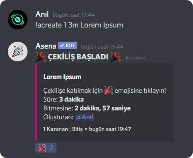
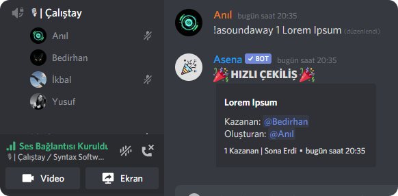
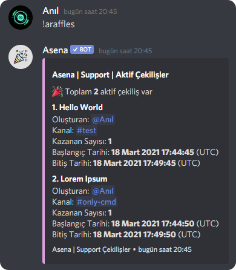
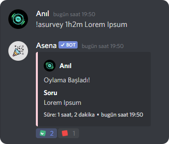
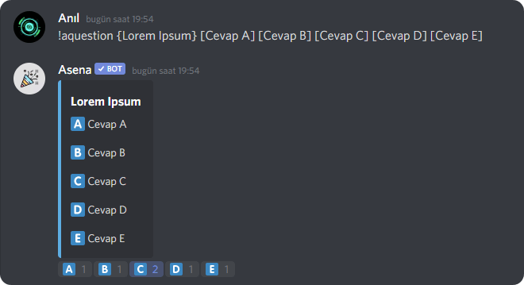
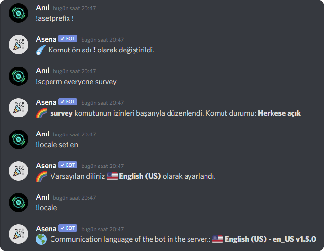

Asena, son kullanıcının yani sizlerin Asena'yı kullanırken mümkün olan en iyi deneyimi yaşadığından emin olmak için bir
dizi özelliğe sahiptir.

## Çekiliş {#giveaway}

Asena ile birbirinden esşiz yeni çekilişler oluşturabilir ve üyelerinize birbirinden güzel ödüller dağıtıp onları mutlu
edebilirsiniz (*veya katılıp kazanamayanları mutsuz* 😄). Ayrıca kazananları tekrar çekebilir, çekilişi iptal edebilir
veya çekilişi erken bitirebilirsiniz. Her türlü esnekliği size sağlıyoruz. Kesinlikle çok havalı!

## Ses Kanallarında Çekiliş {#voice-channel-giveaway}

Asena ile çok kolay bir şekilde belirli bir ses kanalında veya tüm ses kanallarında bulunan üyeleriniz arasında çekiliş
yapabilirsiniz.

## Devam Eden Çekilişleri Listeleme {#listing-ongoing-giveaways}

Sunucunuzda birden fazla çekiliş var ve takip etmekte zorlanıyor musunuz? O halde tam size ve üyelerinize göre bir
şeyimiz var. `/giveaways` ile sunucu içerisinde devam eden çekilişleri tek bir mesaj içerisinde görebilir ve oraya
ışınlanabilirsiniz.

## Anket {#survey}

Asena ile 2 şıklı, süreli veya süresiz anketler başlatabilir ve önemli kararlar vermek için kullanabilirsiniz. *Sadece
arkadaşınızın neli dondurma sevdiğini öğrenmek için de kullanabilirsiniz tabii kiii*

## Soru {#question}

Asena ile merak ettiğiniz sorular oluşturabilir ve dilediğiniz gibi şıklar ekleyebilirsiniz.

## Özelleştirme {#customization}

Komutların herkes tarafından kullanılmasını mı istiyorsunuz? İşte tam size
göre bir özellik. Keyfinize göre komutların durumlarını ve botun dilini değiştirebilirsiniz.

