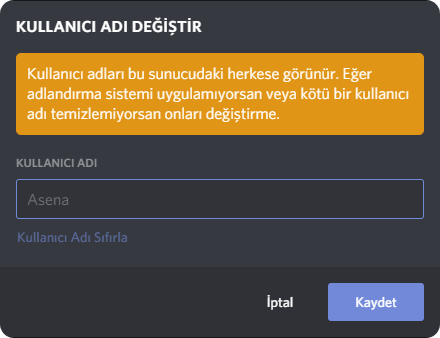

## Giriş {#introduction}

---

### Asena Bot Nedir? {#what-is-asena-bot}

Asena, tek bir hedefe odaklanmış bir Discord çekiliş botudur: Discord'da en iyi çekiliş ve anket deneyimini sunmak.

### Asena'yı kendi sunucuma nasıl ekliye bilirim? {#how-can-i-add-asena-to-my-discord-server}

Asena ekleme kılavuzumuza göz atmak için lütfen [burayı tıklayın](/docs/general/adding-asena).

## Temel Bilgiler {#basic-information}

---

### Sunucumda Asena'nın komut önadını nasıl değiştirebilirim? {#how-can-i-changereset-asena-prefix-in-my-server}

Bu konuda daha fazla bilgi edinmek için [Önek Ayarları](/docs/commands/setprefix) bölümüne gidin.

:::note NOT
`Takma Adları Yönetme` iznine sahip olduğunuzdan emin olun!
:::

### Sunucumdaki Asena'nın komut önadını unuttum! {#forgot-asena-command-prefix-on-the-server}

Asena'nın görebileceği herhangi bir sohbet kanalına `>>prefix` yazarak, Asena'nın sunucu içerisinde komut önadını
öğrenebilirsin.

### Asena'nın takma adını sunucumda nasıl değiştirebilirim? {#how-can-i-change-asena-nickname-in-my-server}

1. Asena'nın adına sağ tıklayın ve Takma Adı Değiştir'e basın. Aşağıdaki gibi bir menü açılacaktır:

2. İstediğiniz takma adı yazın.
3. `Kaydet` butonuna basın ve isim değişsin.

## Sınırlamalar / Kısıtlamalar {#limitations-restrictions}

---

### Asena'nın profil resmini/avatarını sunucumda değiştirebilir miyim? {#can-i-change-asena-profile-pictureavatar-in-my-server}

Hayır, Discord botların profil resimlerini/avatarlarını sunucu içerisinde değiştirmesine izin vermez.

### Asena ile aynı anda kaç tane çekiliş başlatabilirim? {#how-many-lotteries-can-i-start-at-the-same-time-with-asena}

Asena ile aynı anda 5 çekiliş başlatabilirsiniz. Bu sınırı arttırmaya çalışıyoruz.

### Asena ile başlattığım bir çekilişi en fazla kaç kişi katılabilir? {#how-many-people-can-participate-in-a-lottery-that-i-started-with-asena}

Bu konuda herhangi bir kısıtlama bulunmuyor. Yani sınırsız.

### Asena için özel komutlar oluşturabilir miyim? {#can-i-make-custom-commands-for-asena}

Hayır, özel komutlara ve takma adlara izin vermiyoruz. Kullanılabilir takma adları kontrol etmek
için `!ahelp [komut adı]` komutunu çalıştırmanız yeterlidir. Fakat [Asena Discord](https://dc.asena.xyz) sunucusunda
gelip aklınıza gelebilecek tüm takma adları bize önerebilirsiniz.

### Asena aynı anda bu kadar çok sunucuda olması nasıl mümkün olabilir? {#how-is-it-possible-for-asena-to-be-in-so-many-servers-all-in-once}

Discord, 2.000'den fazla sunucudaki botların Sharding adlı bir özelliği kullanmasına izin verir. Asena'nın durumunda,
5.000 sunucu olduğundan çalışma süresini korumak için çok sayıda parçaya ihtiyacımız var. Daha fazla ayrıntı için,
Discord'un Parçalama özelliği hakkında daha fazlasını görüntülemek için [buraya tıklayın](https://discord.com/developers/docs/topics/gateway#sharding).

### Asena diğer botlar tarafından verilen komutları çalıştırabilir mi? {#can-asena-execute-commands-given-by-other-bots}

Hayır, kolayca kötüye kullanılabileceği için Asena diğer botlar tarafından verilen komutlara yanıt vermez. Bu kısıtlama
kaldırılmayacak ve herhangi bir istisna yapılmayacaktır.

## Asena Bağlantıları {#links}

---

### Asena ile ilgili bir sorunla karşılaştım! {#i-have-encountered-an-issue-with-asena}

Acayip sorunlarla mı karşılaşıyorsunuz? Bu sorunlardan herhangi birini çözmenize yardımcı olması için aşağıdaki
bağlantıları kullanabilirsiniz:

* [Davet Sorun Giderme](/docs/general/invite-troubleshooting)
* [Mobil Sorun Giderme](/docs/general/invite-troubleshooting)

### Bu çözümlerin hiçbiri sorunumu çözmedi! {#none-of-these-solutions-solved-my-problem}

Sorunuzun cevabını bu SSS'de veya sorun giderme sayfalarında bulamadıysanız, daha fazla destek için
lütfen [Destek Alın](/docs/general/support) bölümüne gidin.

### Asena Discord sunucusu ne için kullanılır? {#what-is-asena-discord-server-used-for}

Asena'nın Discord Sunucusu, Asena ile ilgili her şey için oluşturulmuş bir yerdir!

1. Sevgili Destek üyelerimizden yardım ve destek alın!
2. Asena'nın yeni özellikleri ve güncellemeleri hakkında bilgilendirileceksiniz.
3. Haberler ve duyurularla güncel Kalın.
4. Büyüyen harika topluluk üyelerimiz ve ekibimizle takılın!
5. Gerçekleşen etkinliklerimize katılın ve keyfini çıkarın!
6. Asena için yeni özellik önerilerinde bulunun.

Sunucumuza katılmak için [buraya](https://dc.asena.xyz) tıklayın.

