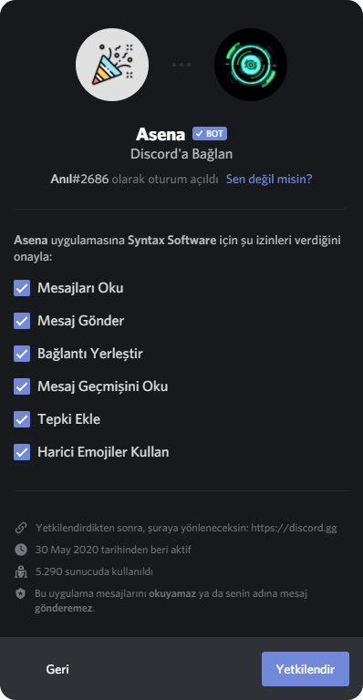
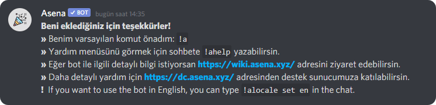

Asena ile çekilişler ve sorular oluşturmaya hazır mısınız? Şu anda herkes için tek bir ücretsiz bot sunuyoruz.

## Asena

<h3>Asena (<code>Asena#2614</code>)</h3>

* Prefix: `!a`
* Asena, çoğu sunucu tarafından kullanılan ana botumuzdur. Bu bot ve özelliklerinin hepsi halka ücretsiz olarak
  sunulmaktadır.

<h2>
    <a href="https://invite.asena.xyz">Asena'yı Davet Et</a>
</h2>

## Yetkilendirme Süreci {#the-authorization-process}

### Adım 1 {#step-one}

Asena davet bağlantısına bastıktan sonra şöyle bir menü görmelisiniz:

Bir sunucu seçin düğmesine dokunun veya tıklayın. Asena'yı eklemek istediğiniz yeri seçmenize izin verecek bir açılır pencere
görünmelidir. 

:::note NOT
Sunucunuzu bu açılır listede görmüyorsanız, [burayı tıklayın](/docs/general/invite-troubleshooting)!
:::

### Adım 2 {#step-two}

Asena'yı eklemek istediğiniz sunucuyu seçtikten sonra, menünün sağ alt kısmındaki Devam düğmesine basabilirsiniz. Şimdi
buna benzer bir şey görmelisiniz:

### Son Adım {#final-step}

Yetkilendir düğmesine bastıktan ve Captcha'yı tamamladıktan sonra, [Asena Destek](https://dc.asena.xyz) sunucusuna
yönlendirilmelisiniz. Bu botun sunucunuza başarıyla eklendiği anlamına gelir. Ek olarak Discord sunucunuzda aşağıdaki
gibi bir mesaj da göreceksiniz. **İnanılmaz!**

:::caution DİKKAT 
Eğer Asena'yı sunucunuzda göremiyorsanız üye listesinden bunu doğrulayın. Üye listesinde Asena'yı
görüyorsanız bota gerekli yetkileri sağlayın. Aksi takdirde Asena'yı halen göremiyorsanız koruma botu görevi yapan
botlar Asena'yı sunucudan atıyor olabilir, bunu engelleyin.
:::

Şimdi bazı [çekilişler oluşturararak](/docs/commands/create) partiye başlayalım!

Asena'yı davet etmeyle ilgili herhangi bir sorun için [Davet Sorun Giderme](/docs/general/invite-troubleshooting)
bölümüne bakabilirsiniz.
