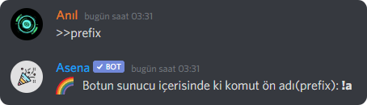

Acayip sorunlarla mı karşılaşıyorsunuz? Buraya bakın!

## Asena'nın komut önekini bilmiyorum. Ne yapmalıyım? {#i-dont-know-asena-prefix-what-should-i-do}

Asena'nın komut önekini bilmiyor veya unutuyorsanız, strese girmeyin. Biz sizin için bunu düşündük. Asena'nın
görebileceği bir sohbet kanalına `>>prefix` yazarak bunu kolayca öğrenebilirsiniz.

:::tip İPUCU
Asena, slash komutlar ile kullanılmaktadır bu yüzden komut önadı (prefix)`/`'dır.
:::

## Asena komutlarıma yanıt vermiyor! {#asena-isnt-responding-to-my-commands}

*Asena komutlara yanıt vermiyorsa aşağıdakileri deneyin:*

1. **Asena'nın çevrimiçi olduğundan emin olun.**

* Asena çevrimdışıysa, botu sunucunuzdan atıp tekrar davet etmeyi deneyin. Bunu yaptıktan sonra Asena hala çevrimdışı
  olarak gösteriliyorsa, 4. adıma atlayabilirsiniz.
   
2. **Doğru öneki kullandığınızdan emin olun.**

* Sunucunuzdaki mevcut öneki almak için sohbete `>>prefix` yazabilirsiniz.
  
  

* Komut önekinizi nasıl değiştireceğinizi öğrenmek için [buraya tıklayabilirsiniz](/docs/commands/setprefix).

3. **Asena'nın kanalda mesaj okuma ve gönderme izinlerine sahip olduğundan emin olun.**

* Bunu kolaylaştırmak için Asena'ya Yöneticiye izni verebilirsiniz.

4. **Herhangi bir sorun olup olmadığını görmek
   için [resmi Asena Bot Discord sunucumuzdaki](https://dc.asena.xyz) [#duyuru](https://discord.com/channels/701790578874253363/717335961607864361)
   kanalımıza bir göz atın.**

5. **Yukarıdaki yöntemler işe yaramazsa, Destek Ekibimizin bir üyesinden yardım almak için lütfen Asena Bot Discord
   sunucusuna gelip bilgi alın.**

[Resmi Asena Bot Discord sunucusuna katılmak için burayı tıklayın.](https://dc.asena.xyz)

## Yukarıdaki her şeyi okudum ama hiçbiri sorunumu çözmedi. Ben ne yapmalıyım? {#i-have-read-everything-above-but-none-fixed-my-issue-what-do-i-do}

Yukarıdaki listeden hiçbir şey size yardımcı olmadıysa, lütfen [Destek Alın](./support) bölümüne gidin.
