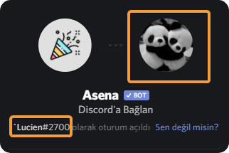
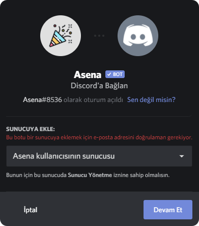

Asena sunucuma katılmıyor! Bu acil bir durum, ne yapacağım?!

## Asena'yı eklerken, sunucumu listede göremiyorum! {#when-adding-asena-i-cant-see-my-server-in-the-list}

### Doğru hesapta mı oturum açtınız? {#are-you-signed-into-the-correct-account}

Sunucunuzu açılır bölümde bulamıyorsanız, bunun çeşitli nedenleri olabilir. Öncelikle, doğru hesapta oturum açtığınızdan
emin olmalısınız. Eğer hesap size ait değilse maviye basın **Sen değil misin?** düğmesine.

### Asena'yı eklemek istediğiniz sunucuda izinleriniz var mı? {#do-you-have-permissions-in-the-server-you-want-to-add-asena-to}

Doğru hesapta oturum açtığınızdan **%100** eminseniz, o zaman doğru izinlere sahip olduğunuzdan emin olmalısınız. Bir
bot eklemek için, `Sunucuyu Yönet` veya `Yönetici` izinlerine sahip olmanız gerekir. Sunucu sahibiyseniz, elbette
bunlara sahipsiniz.

:::tip İPUCU
Sunucunun adını değiştirebiliyorsanız, gerekli izinlere sahipsiniz!
:::

### Gizli bir sekme açın ve oradan Asena'yı davet edin. {#open-an-incognito-tab-and-invite-asena-from-there}

Eğer **doğru hesapta oturum açtığınıza eminseniz** ve **sunucuda Asena'yı eklemek istediğiniz izinleriniz varsa**, daha
sonra gizli bir sekme açmalı ve oradan Asena'yı davet etmelisiniz. Aşağıda, en popüler tarayıcılar için en yaygın klavye
kısayollarını listeleyen bir tablo bulunmaktadır:

| Browser  | Windows/Linux | MacOS       |
|:--------:|:-------------:|:-----------:|
| Chrome   | CTRL+Shift+N  | CMD+Shift+N |
| Firefox  | CTRL+Shift+P  | CMD+Shift+P |
| Opera    | CTRL+Shift+N  | CMD+Shift+N |
| MS Edge  | CTRL+Shift+N  | CMD+Shift+N |
| Explorer | CTRL+Shift+P  | N/A         |
| Safari   | N/A           | CMD+SHIFT+N |

#### Bu neden gerekli? {#why-is-this-necessary}

Discord, verileri çerezlerde önbelleğe aldığından, Discord'un botları davet ederken kullanmaya çalıştığı eski oturum
bilgilerini korur. Gizli özel bir yeni sekme açarak, Discord botunu herhangi bir sorun olmadan davet etmenize izin
verecek yeni bir oturum açmaya zorlarsınız!

## Asena'yı eklerken Discord benden e-posta adresimi doğrulamamı istiyor. {#when-adding-rythm-discord-asks-me-to-verify-my-e-mail-address}

Discord, sunucularınıza bot eklemek için e-posta hesabınızı doğrulamanızı gerektirir. Kullanıcı Ayarlarına gidin ve
orada e-postanızı doğrulayın.

## Asena'yı cep telefonumla davet edemiyorum! {#i-cant-invite-asena-on-my-mobile}

Mobilde Asena'yı davet etmek ile ilgili herhangi bir sorun için, [Mobil Sorun Giderme](/troubleshooting/mobile.md)
bölümüne bakın.

## Yukarıda listelenmeyen Asena botunu eklemeyle ilgili başka sorunlar yaşıyorum {#i-am-having-other-issues-with-adding-asena-that-isnt-listed-above}

Bunları yapabilirsin:

- Herhangi bir sorun olup olmadığını görmek için [Discord'un Durum sayfasına](https://discordstatus.com/)
  veya [resmi Asena Bot Discord sunucumuzdaki](https://dc.asena.xyz)
  [#duyurular](https://discord.com/channels/701790578874253363/717335961607864361) kanalımıza bir göz atın.

- Sorunla ilgili herhangi bir şey bulamazsanız, Destek sunucumuza gelerek Moderatörlerimiz veya Destek Ekibimizin bir
  üyesinden yardım alabilirsiniz.

[Resmi Asena Discord Bot sunucusuna katılmak için burayı tıklayın](https://discord.gg/v2sATCAaMY)
