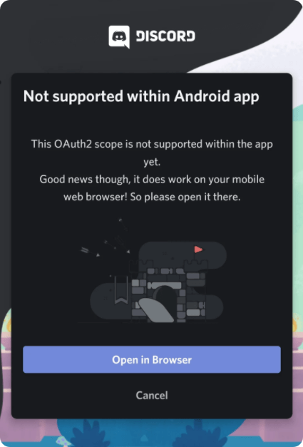

## Sunucuma Asena botu ekleyemiyorum! {#i-cant-add-asena-bot-my-server} 

Mobil cihazdaysanız ve Asena ekleme bağlantısı **"Android uygulamasında desteklenmiyor"** hatası oluşturduğu için Asena'yı ekleyemediğinizi fark ederseniz, lütfen önce **https://discord.com/login** adresine gitmeyi, oturum açmayı ve ardından davet bağlantısını tekrar kullanmayı deneyin.

**Bu işe yaramazsa**, Asena'yı davet etmek için bir masaüstü cihaz kullanmanızı öneririz.

**Kısaca:** Asena'yı eklemek veya bir masaüstü cihaz kullanmak için başka web tarayıcılar deneyebilirsiniz!

## "Android uygulamasında desteklenmiyor" hatasıyla karşılaştım, ne yapmalıyım? {#error-not-supported-android-app} 

Asena'yı davet ederken bu hatayla karşılaşırsanız, bir **Gizli Sekme** açmayı deneyin ve bu bağlantıyı arama çubuğuna kopyalayın:
https://discord.com/oauth2/authorize?permissions=347200&scope=bot&client_id=716259870910840832&redirect_uri=https%3A%2F%2Fdiscord.gg%2FCRgXhfs&response_type=code

Gizli Sekmeyi nasıl açacağınızı öğrenmek için [buraya tıklayın.](https://support.google.com/chrome/answer/95464)

Hala sorun yaşıyorsanız, lütfen bizimle [bu adresten](/docs/general/support) iletişime geçmekten çekinmeyin.
